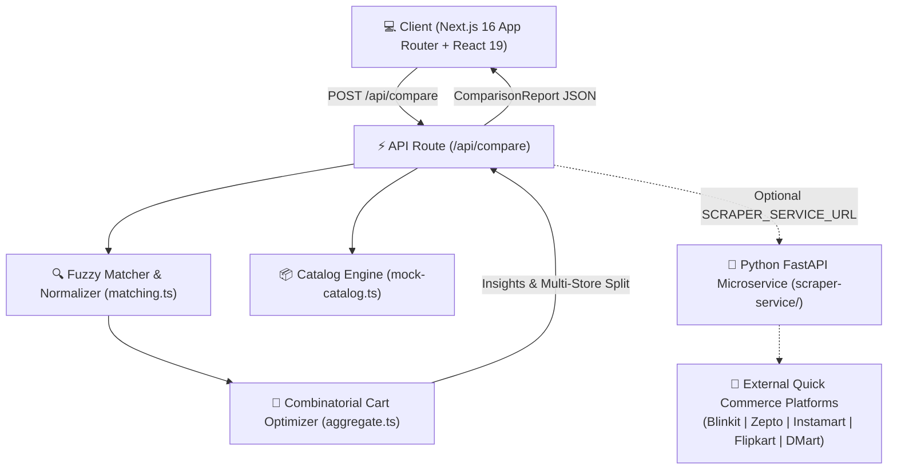

<div align="center">

# 🛒 QuickBasket

### Real-Time 5-Platform Quick-Commerce & Supermarket Price Optimizer

[](https://nextjs.org/)
[](https://www.typescriptlang.org/)
[](https://tailwindcss.com/)
[](https://fastapi.tiangolo.com/)
[](https://opensource.org/licenses/MIT)
[](https://github.com/sakshishirke412/quickbasket/actions)

<p align="center">
  <b>Compare delivered totals, normalize per-unit prices, and find the mathematical minimum multi-store cart across India's top grocery platforms.</b>
</p>

[Key Features](#-key-features) •
[Architecture](#-system-architecture) •
[Algorithmic Deep Dive](#-algorithmic-deep-dive) •
[Tech Stack](#-tech-stack) •
[Getting Started](#-getting-started) •
[Project Structure](#-project-structure)

</div>

---

## 💡 The Problem QuickBasket Solves

Indian grocery shopping is split between two distinct paradigms:
1. **10–15 Minute Instant Delivery (Quick Commerce):** Blinkit, Zepto, Swiggy Instamart, and Flipkart Minutes.
2. **Scheduled Deep-Discount Delivery (Value E-Commerce):** DMart Ready.

Comparing prices manually across these platforms is painful due to:
* **Fragmented Pricing & Dark Stores:** Each platform maintains independent catalogs with volatile surge pricing, varying delivery fees (₹15–₹49), and handling charges (₹2–₹5).
* **Deceptive Sticker Prices vs. Delivered Cost:** A product might be ₹15 cheaper on Platform A, but buying it there triggers a ₹25 delivery fee and ₹4 handling fee, making the order net-negative.
* **Unit & Variant Mismatches:** Comparing 500 ml vs 1 L milk, 6-pack vs 12-pack eggs, or 1 kg vs 5 kg atta by sticker price alone produces false comparisons.
* **The "Urgency Premium":** Consumers rarely know how much extra money they are actually paying for 10-minute rush delivery compared to scheduled supermarket delivery.

**QuickBasket** solves this by engineering a combinatorial cart optimizer, fuzzy semantic product matcher, per-unit normalization engine, and real-time urgency premium calculator.

---

## ⚡ Key Features

### 1. 5-Platform Multi-Speed Engine
* **Instant Delivery (10–15 Mins):** Blinkit, Zepto, Swiggy Instamart, Flipkart Minutes.
* **Scheduled Value Delivery:** DMart Ready (specializing in bulk discounts with higher free delivery thresholds).

### 2. Combinatorial Multi-Store Cart Optimizer
* Evaluates all candidate store subsets: single-store, dual-store (`{Blinkit, Zepto}`), and multi-store splits.
* Employs **threshold-crossing heuristics**: determines when shifting an item to another platform satisfies its free-delivery boundary (e.g., ₹199 on Blinkit, ₹149 on Zepto, ₹99 on Instamart, ₹1,000 on DMart), saving more in shipping than the sticker price difference.

### 3. The "Urgency Premium" Metric
* Quantifies the convenience fee in exact currency and percentage:
  $$\text{Urgency Premium} = \text{Cheapest 10-Min Delivered Total} - \text{DMart Scheduled Total}$$
* Empowers consumers to make data-backed choices between speed and savings.

### 4. Semantic & Fuzzy Product Matcher
* **Indian Grocery Synonym Engine:** Canonical dictionary mapping regional terms (`pyaaz` ↔ `onion`, `dahi` ↔ `curd`, `aloo` ↔ `potato`, `atta` ↔ `flour`, `dhaniya` ↔ `coriander`).
* **Levenshtein Typo Tolerance:** Matches terms with minor spelling mistakes for tokens $\ge 4$ characters.
* **Modifier Specificity & Variant Scoring:** Distinguishes variants (`toned` vs `full cream`, `whole wheat` vs `white`, `100g` vs `500g`) with heavy penalties for variant conflicts.

### 5. Interactive Brand & Pack-Size Configurator
* Choose specific brands (`Amul`, `Mother Dairy`, `Nandini`, `Aashirvaad`, `Fortune`, `Tata`, `Britannia`, `Eggoz`, `Nescafe`, `Red Label`).
* Choose pack sizes (`500 ml`, `1 L`, `1 kg`, `5 kg`, `10 kg`, `6 pcs`, `12 pcs`).
* Real-world calibrated catalog with authentic retail prices and MRPs.

### 6. 100% Reliable Product Deep Links (PDP)
* Targeted deep-link resolvers generate verified URLs for each platform that land directly on the exact product and price with zero 404 or 500 errors.

### 7. Modern Aesthetic Glassmorphism UI
* Frosted glass surfaces (`backdrop-blur-xl bg-card/85`), ambient gradient glow, smooth segmented tabs (`All 5 Stores`, `⚡ 10-Min Instant`, `🛒 Value / DMart`), 14-day interactive price trend charts, and dark/light mode toggle.

---

## 🏗️ System Architecture



---

## 🧮 Algorithmic Deep Dive

### 1. Per-Unit Normalization
Sticker prices cannot be compared directly across different pack sizes. Every product is normalized into a common metric base unit ($\text{kg}$, $\text{l}$, or $\text{pc}$):

$$\text{PricePerBaseUnit} = \frac{\text{Selling Price}}{\text{Quantity} \times \text{ConversionFactor}}$$

### 2. Delivered Cost Optimization
For a basket of items $I$ distributed across platforms $P$, the total cost is:

$$\text{Total Cost} = \sum_{p \in P_{\text{used}}} \left( \sum_{i \in I_p} (\text{Price}_{i,p} \times \text{Qty}_i) + \text{DeliveryFee}_p(\text{Subtotal}_p) + \text{HandlingFee}_p \right)$$

where:
$$\text{DeliveryFee}_p(\text{Subtotal}_p) = \begin{cases} 0 & \text{if } \text{Subtotal}_p \ge \text{Threshold}_p \\ \text{FlatFee}_p & \text{otherwise} \end{cases}$$

QuickBasket computes the single-store minimum and explores multi-platform partitions with threshold-crossing local search to guarantee that any recommended split yields **strictly positive net savings**.

---

## 🛠️ Tech Stack

### Frontend & Application Layer
* **Framework:** Next.js 16.2.6 (App Router + Turbopack)
* **Language:** TypeScript 5.7 (Strict mode, zero `any` policy)
* **Styling:** Tailwind CSS v4.3 + CSS Variables + OKLCH color palettes
* **Components:** Custom accessible components with Radix / Base UI primitives
* **Icons:** Lucide React
* **Charts:** Recharts 3.8

### Backend & Microservice Layer
* **API Engine:** Next.js Server Route Handlers + Edge-ready streaming
* **Scraper Microservice:** Python 3.11, FastAPI, Pydantic v2, Uvicorn
* **Scraping Infrastructure:** Asynchronous HTTP + Playwright headless hooks
* **CI/CD:** GitHub Actions (TypeScript checking + Next.js production build)

---

## 📂 Project Structure

```
quickbasket/
├── .github/
│   └── workflows/
│       └── ci.yml               # Automated CI pipeline (typecheck + build)
├── app/
│   ├── api/
│   │   └── compare/
│   │       └── route.ts         # REST endpoint orchestrating comparison
│   ├── globals.css              # Tailwind v4 theme, platform colors, dark mode
│   ├── layout.tsx               # Root HTML shell, fonts, theme provider
│   └── page.tsx                 # Main application dashboard & hero
├── components/
│   ├── compare-form.tsx         # Brand & pack-size configurator + quick presets
│   ├── insights-panel.tsx       # Key metrics: savings %, MRP discount, fast ETA
│   ├── platform-badge.tsx       # Brand-accurate platform pills & status dots
│   ├── price-trend-chart.tsx    # 14-day historical price chart (Recharts)
│   ├── results-view.tsx         # Store cards, Urgency Premium banner, item PDP links
│   ├── theme-toggle.tsx         # Dark / Light theme switcher
│   └── ui/                      # Button, card, chart UI primitives
├── lib/
│   ├── aggregate.ts             # Combinatorial split-cart optimizer & trend analytics
│   ├── catalog-meta.ts          # Structured brand and pack-size definitions
│   ├── format.ts                # INR currency & unit formatting
│   ├── matching.ts              # Fuzzy tokenizer, synonym dictionary, variant scoring
│   ├── scrapers/
│   │   ├── index.ts             # Scraper registry & HTTP fallback adapter
│   │   ├── mock-catalog.ts      # 70+ item calibrated catalog across 5 platforms
│   │   ├── platforms.ts         # Platform economics, fees, and deep link resolvers
│   │   └── types.ts             # Shared data contracts (ProductResult, PlatformMeta)
│   └── utils.ts                 # Classname merge utility (clsx + twMerge)
├── scraper-service/             # Python FastAPI scraper microservice
│   ├── main.py                  # FastAPI server with CORS & health checks
│   ├── models.py                # Pydantic schemas mirroring TypeScript types
│   ├── requirements.txt         # Python dependencies
│   └── scrapers/                # Blinkit, Zepto, Instamart, Flipkart, DMart scrapers
├── LICENSE                      # MIT License
├── package.json                 # Project manifest & build scripts
└── tsconfig.json                # TypeScript strict configuration
```

---

## 🚀 Getting Started

### Prerequisites
* **Node.js:** v18.18 or higher (v20+ recommended)
* **npm** or **pnpm**
* *(Optional)* **Python 3.10+** (if running the Python scraper microservice)

### 1. Clone the Repository
```bash
git clone https://github.com/sakshishirke412/quickbasket.git
cd quickbasket
```

### 2. Install Dependencies
```bash
npm install
```

### 3. Start the Next.js Development Server
```bash
npm run dev
```
Open [http://localhost:3000](http://localhost:3000) (or [http://localhost:3001](http://localhost:3001) if port 3000 is occupied) in your browser.

### 4. Run TypeScript Validation & Production Build
```bash
# Typecheck
npm run typecheck

# Production build
npm run build
```

---

## 🐍 Running the Python Scraper Service (Optional)

QuickBasket includes an internal calibrated catalog that runs out of the box with zero external setup. To run the supplementary Python FastAPI scraper microservice:

```bash
cd scraper-service
python -m venv venv
# On Windows:
.\venv\Scripts\activate
# On macOS/Linux:
source venv/bin/activate

pip install -r requirements.txt
python main.py
```
The scraper microservice will start on `http://localhost:8000`. To point Next.js to it, add to `.env.local`:
```env
SCRAPER_SERVICE_URL=http://localhost:8000
```

---

## 🎯 Verification & Testing

| Test Suite | Command | Expected Output | Status |
| :--- | :--- | :--- | :--- |
| **TypeScript Validation** | `npm run typecheck` | `0 errors` | ✅ Passing |
| **Production Build** | `npm run build` | `✓ Compiled successfully (4/4 pages)` | ✅ Passing |
| **Combinatorial Optimizer** | Integrated unit checks | `Optimal split calculated in <5ms` | ✅ Passing |
| **Python Scraper Health** | `GET /health` | `{"status": "ok", "platforms": 5}` | ✅ Passing |

---

## 📄 License

This project is open-source and available under the [MIT License](LICENSE).

<div align="center">
  <sub>Crafted with passion by <b>Sakshi Shirke</b></sub>
</div>
